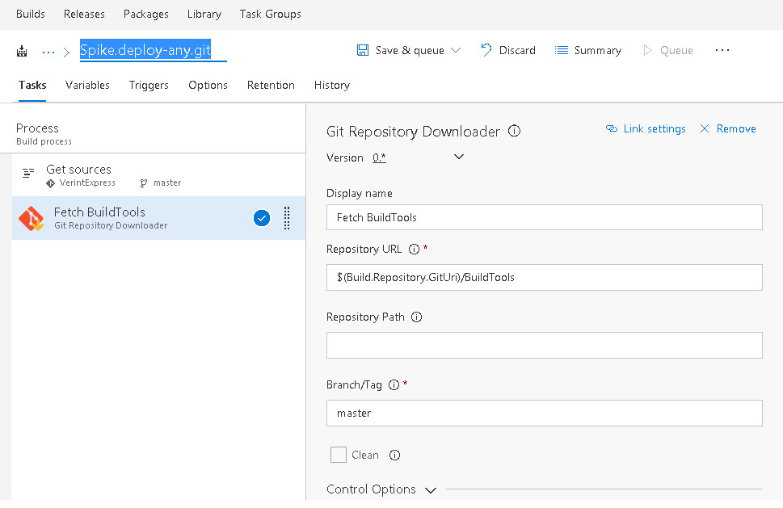
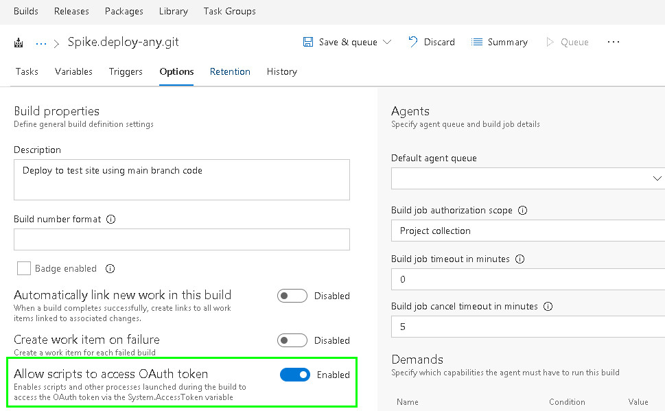

# Git Downloader


This task will download git repository as an addition to default source. Consider this task as workaround where TFS build with git repository can only download 1 repository. Then this task will download another git repository required by your TFS build definition. This task assumes that git is already installed in PATH environment variable or %ProgramFiles%\\Git within TFS build agent's machine.

## Parameters

1.  Repository URL

    URL of git repository. The repository should be public that can be downloaded without authentication. If it's the same location of main repository (specified in `Get sources`/first task of the build), then it's automatically uses the same credential.

    Use `$(Build.Repository.GitUri)` to refer relative URI for git URL, examples:
    -   https://your-onpremise-tfs.com/tfs/DefaultCollection/TeamProject/_git/GitRepo
    -   https://youraccount.visualstudio.com/TeamProject/_git/GitRepo
    -   $(Build.Repository.GitUri)/GitRepo

2.  Repository Path

    Full path to store the git repository. If not specified, then it will be located in $(Build.GitDirectory)\\[repo name].

3.  Branch/tag

    Branch/tag to checkout. By default, it will download single branch/tag and will checkout to that branch/tag automatically.

4.  Clean

    If this is true, it will remove previously downloaded repository and use `git clone` command to download. Otherwise, it will stash everything and pull the remote branch/tag.



By default, this task expects public git repository that can be downloaded without authentication. But when the git repository is located in same TFS server, than it requires OAuth token for successful download. You can enable it in **Options** tab and check for **Allow scripts to access OAuth token** like screenshot below:


For YAML build, we need to expose the token to environment variable manually (named **SYSTEM_ACCESSTOKEN**) as follows:

```yml
- task: fakhrulhilal-maktum.GitDownloader.git-downloader.GitDownloader@0
  displayName: Build Scripts
  inputs:
    RepositoryUrl: '$(Build.Repository.GitUri)/repo'
  env:
    SYSTEM_ACCESSTOKEN: $(System.AccessToken)
```

The git URL is considered the same TFS server when it's located in the same URL as TFS server (ignoring HTTP protocol). Supposed we have TFS public URL http://yourdomain/, so these URLs are considered the same TFS server:

- https://yourdomain/tfs/DefaultCollection/TeamProject/_git/GitRepo
- http://yourdomain/tfs/DefaultCollection/_git/TeamProject
- https://yourdomain/tfs/DefaultCollection/AnotherTeamProject/_git/GitRepo
- https://yourdomain/tfs/DefaultCollection/_git/AnotherTeamProject
- $(Build.Repository.GitUri)/GitRepo

And these are considered as different TFS server (means should be downloadable without authentication):

- https://yourdomain.root.domain.com/tfs/DefaultCollection/TeamProject/_git/GitRepo
- http://yourdomain.root.domain.com/tfs/DefaultCollection/_git/TeamProject
- https://yourdomain.root.domain.com/tfs/DefaultCollection/AnotherTeamProject/_git/GitRepo
- https://yourdomain.root.domain.com/tfs/DefaultCollection/_git/AnotherTeamProject

This extension relies on [`$(System.TeamFoundationCollectionUri)`](
https://docs.microsoft.com/en-us/vsts/build-release/concepts/definitions/build/variables#systemteamfoundationcollectionuri) variable to check for same server. To ensure which domain your TFS server is running on, try to create dummy build definition and create one PowerShell task containing this code: 
```PowerShell
Write-Host "$Env:SYSTEM_TEAMFOUNDATIONCOLLECTIONURI"
```

# Requirements

## Pipeline Agent

This plugin uses new [Powershell3](https://github.com/microsoft/azure-pipelines-task-lib/blob/master/node/docs/minagent.md#user-content-task-execution-handler) handler that requires at least pipeline agent version 1.95.1.

## Azure DevOps Server

As of [Powershell3](https://github.com/microsoft/azure-pipelines-task-lib/blob/master/node/docs/minagent.md#user-content-task-execution-handler) handler, this plugin requires at least TFS 2015 Update 2. 